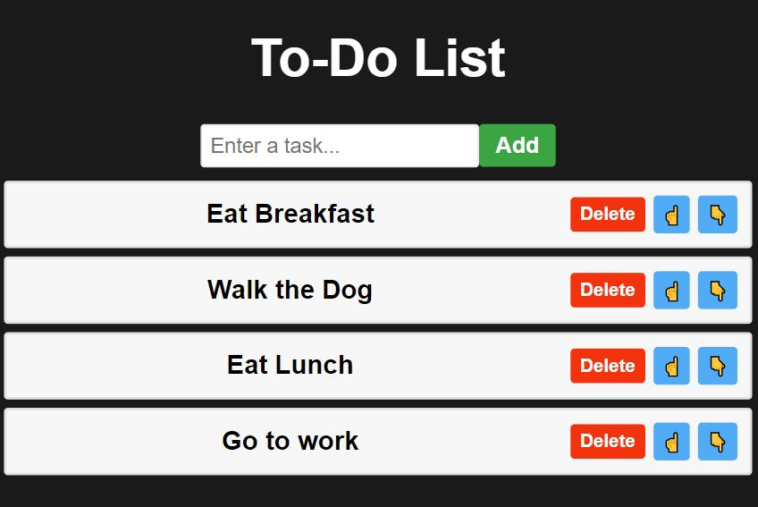

# To-Do List App

## Project Description

Presenting a dynamic To-Do List application designed and developed with React and CSS. Complete with media queries, it is optimally responsive across all devices. This intuitive application empowers users to efficiently manage their tasks and stay organized, whether they're on their desktop, tablet, or smartphone. With its user-friendly interface and features, users can easily add, edit, and delete tasks, prioritize their to-dos, and track their progress effortlessly. Say goodbye to forgetfulness and hello to productivity with this versatile To-Do List application.

## Deployment Screenshot

[Deployment Link]()

## Credits

- Project was completed by Travis Fowlston.

## License

- Please refer to the LICENSE in the repository.